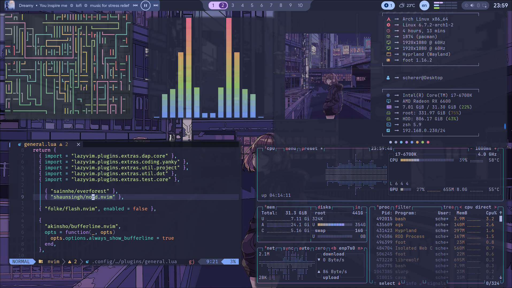
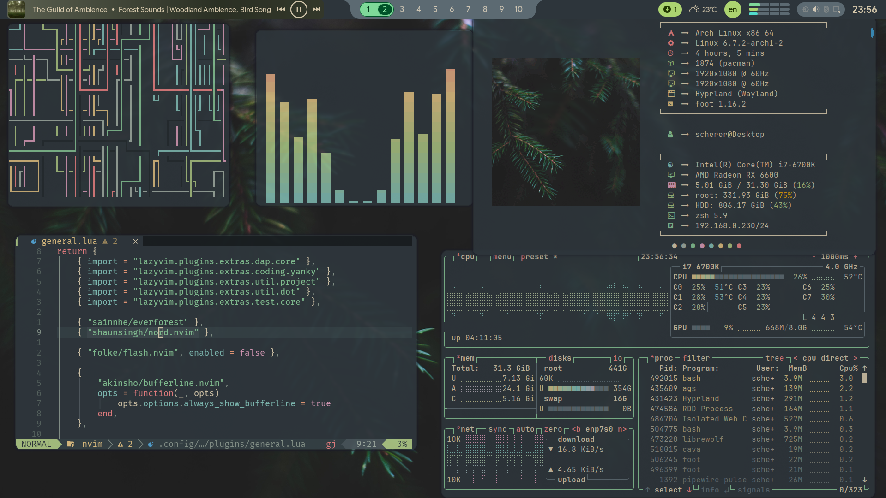
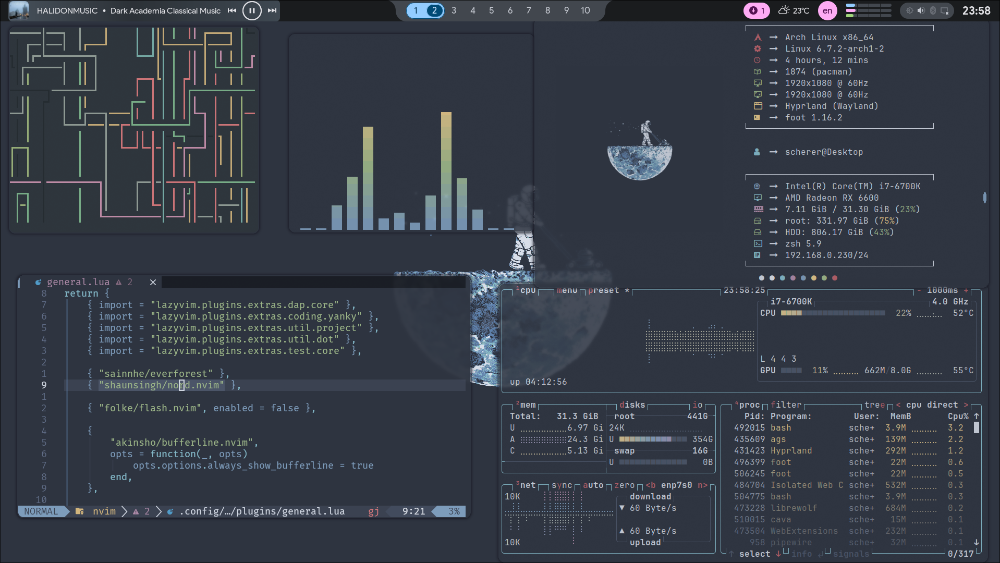

# Dotfiles

## Installation

```sh
curl -O https://raw.githubusercontent.com/Vinschers/dotfiles/master/.config/setup/setup.sh
chmod +x setup.sh
./setup.sh
```

### Change GitHub to use SSH instead of HTTPS

First, configure ssh access following
[this](https://docs.github.com/en/authentication/connecting-to-github-with-ssh/generating-a-new-ssh-key-and-adding-it-to-the-ssh-agent)
tutorial. Then, run

```sh
dotfiles remote set-url origin git@github.com:Vinschers/dotfiles.git
```

## Post-Installation

Download the Photoshop 2021 archive [here](https://qiwi.gg/file/kMnq2220-AdobePhotoshop2021) and check its SHA256.

```sh
[ "$(sha256sum AdobePhotoshop2021.tar.xz | awk '{print $1}')" = "8321b969161f2d2ad736067320d493c5b6ae579eaab9400cd1fda6871af2c033" ] && echo ok
```

Extract the archive to `.config/setup/programs/`
Run the script at `.config/setup/after_install.sh`

## Setup wi-fi

First, start the iwd service with `sudo systemctl enable iwd`.
If the internet does not work immediately, try configuring DHCP.
To do so, install the `dhcpcd` and run `sudo systemctl enable dhcpcd.service`.

## Showcase

### Tokyonight



### Everforest



### Nord


